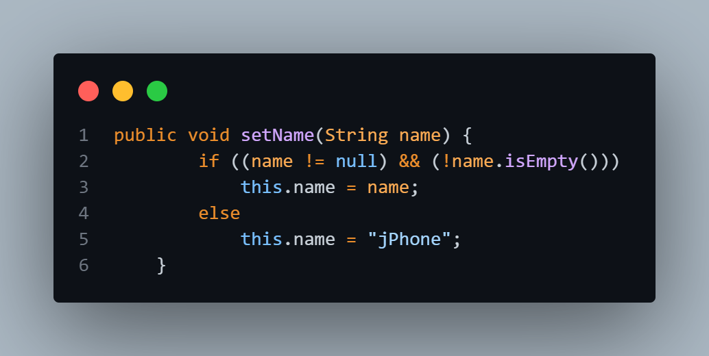

# Tips about OrangePhone class
## why I checked null before checking empty in this method?
if we check null after checking empty, it's possible that the 'name' parameter is null;  
When the name is null and you want to check if it's empty by performing the isEmpty() method on null object,
it causes an error called (NullPointerException).

### you will learn about exceptions in the rest of class 
.
